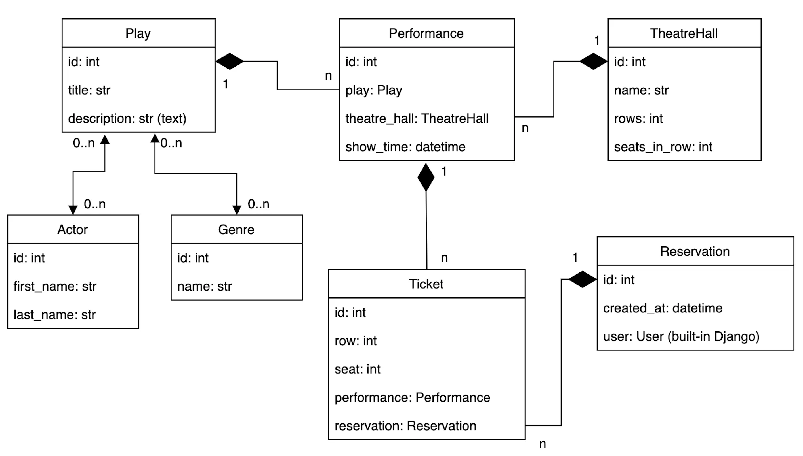

# Theatre api service


This is an API for a theater website. Using this API, you can create a website where you can view upcoming performances, their genres, and the actors who play in these performances. View available seats in the theater hall and create orders with tickets. 

The API has the following database structure:



## You can get the API from Docker

```shell
docker pull dirolius/theatre_api_service-app

```

## Installation

Python3 must be already installed!

You also need to install PostgreSQL and create a database.

```shell
git clone https://github.com/dirolius/theatre-api-service
cd theatre_api_service
python3 -m venv venv
source venv/bin/activate
pip install -r requirements.txt
touch .env
```
For Windows, the command "touch .env" will be "echo > .env"

For an example of filling out .env, see .env.sample!
```shell
python manage.py migrate
python manage.py runserver
```

## Run with docker

Docker must be already installed!

Uncomment string `MEDIA_ROOT = "/vol/web/media"` in setting.py 
    
```shell
git clone https://github.com/dirolius/theatre-api-service
cd Dockerize-DRF-theatre
docker-compose up
```

## Features:


- JWT authenticated:
- Admin panel: /admin/
- Documentation is located at: </api/doc/swagger/>, </api/doc/redoc/>
- Managing reservations and tickets
- Creating plays with genres and actors
- Creating theatre halls
- Creating performances with show time, play and theatre hall
- Filtering plays and performances


### Getting access

You can create superuser:

```shell
python manage.py createsuperuser
```
or create a default user using the following links

`http://127.0.0.1:8000/api/user/register/`

To work with token use:

- get access token and refresh token http://127.0.0.1:8000/api/user/token/
- refresh access token http://127.0.0.1:8000/api/user/token/refresh/
- verify access token http://127.0.0.1:8000/api/user/token/verify/

#### Note: Make sure to send Token in api urls in Headers as follows

- key: Authorization

- value: Bearer `<token>`


### Theatre API allows:
- using api/admin/ --- Work with admin panel
- using /api/doc/swagger/ --- Detail api documentation by swagger
- using /api/doc/redoc/ --- Detail api documentation by redoc
- using [GET] /api/user/me/ --- Information about user
- using [PUT, PATCH] /api/user/me/ --- Update user information
- using [POST] /api/user/register/ --- Register a new user
- using [POST] /api/user/token/ --- Obtain new Access and Refresh tokens using credential
- using [POST] /api/user/token/refresh/ --- Obtain new Access token using refresh token
- using [POST] /api/user/token/verify/ --- Verify Access token
- using [GET] /api/theatre/actors/ --- Actors list
- using [POST] /api/theatre/actors/ --- Add new actor
- using [GET] /api/theatre/genres/ --- Genres list
- using [POST] /api/theatre/genres/ --- Add new genre
- using [GET] /api/theatre/performances/ --- Performances list
- using [POST] /api/theatre/performances/ --- Add new performance
- using [GET] /api/theatre/performances/{id}/ --- Performances detail information
- using [PUT, PATCH] /api/theatre/performances/{id}/ --- Update performance information
- using [DELETE] /api/theatre/performances/{id}/ --- Delete performance information
- using [GET] /api/theatre/plays/ --- Plays list
- using [POST] /api/theatre/plays/ --- Add new play
- using [GET] /api/theatre/plays/{id}/ --- Play detail information
- using [POST] /api/theatre/plays/{id}/upload-image/ --- Upload image for play
- using [GET] /api/theatre/orders/ --- Reservations list
- using [POST] /api/theatre/orders/ --- Add new reservation
- using [GET] /api/theatre/theatre_halls/ --- Theatre halls list
- using [POST] /api/theatre/theatre_halls/ --- Add new theatre hall
